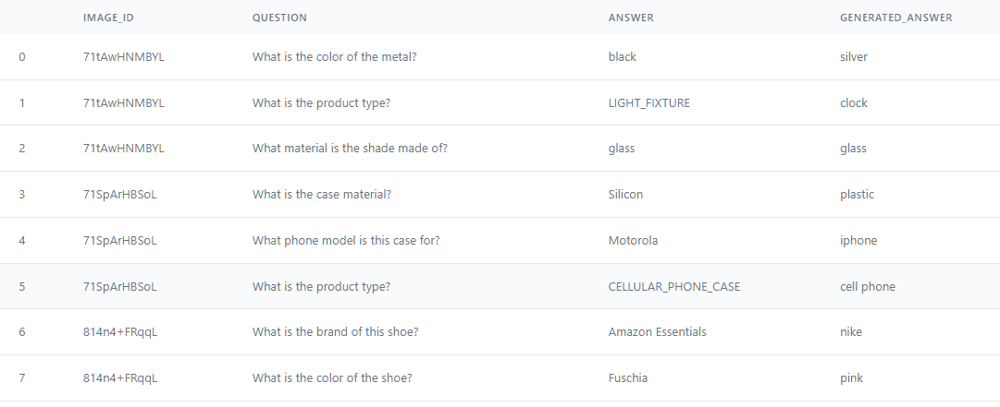
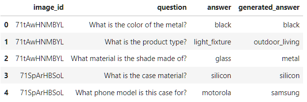

# 📘 Report on Multimodal Visual Question Answering with Amazon Berkeley Objects Dataset


## Contributors:
- Ankit Gahlawat - PH2024002
- Kushagra Mehrotra - MS2024011
- Garvit Singla - MS2024009


## 1. **Data Curation**

We curated a Visual Question Answering (VQA) dataset using the **Amazon Berkeley Objects (ABO)** dataset. 
The goal was to generate diverse, image-grounded, single-word question-answer pairs using both product images and associated metadata.

### 🔧 Tools Used

- **Gemini 1.5 Flash** (via Google AI Studio): Used for generating questions based on image and metadata.
- **Python + Google SDK (`google-genai`)**: Handled multimodal prompts.
- **Metadata**: Parsed from `listings_1.json` (and various other listings) and `images.csv` from the ABO dataset.

### 🧠 Prompt Design

We used a structured prompt to instruct the model to:

- Ask 3 image-grounded questions.
- Ensure answers were **single words** and **present in metadata**.
- Format the response as a valid JSON array of Q-A pairs.

Example prompt snippet:
```json
[
  {
    "question": "What color is the blender?",
    "answer": "white"
  },
  {
    "question": "What material is the blender made of?",
    "answer": "plastic"
  }
]
```

### 🔁 Process Pipeline

1. Randomly sampled **3500** product listings from ABO.
2. Used 3000 for training and kept aside 500 for testing.
3. Merged listings with image metadata to obtain image paths and dimensions.
4. Extracted metadata fields like `color`, `material`, `brand`, `product_type`, etc.
5. For each product image:
   - Read the image in binary.
   - Fused it with metadata into a multimodal Gemini prompt.
   - Parsed the returned JSON of 3 Q-A pairs.
   - Stored all output in timestamped JSON files.

### 🛠 Sample Output Format

Each curated sample includes:
```json
{
  "image_id": "abc123",
  "image_path": "/images/small/ab/abc123.jpg",
  "question": "What is the color of the object?",
  "answer": "red"
}
```

Although we used JSON format, we have provided the dataset in CSV format as the project demanded.<br>
Inside the folder curated_dataset, the data is divided into train and test files.

---

## 2. **Model Choices**


### ❓ Models Considered

| Model     | Reason for Rejection                                                                    |
| --------- | --------------------------------------------------------------------------------------- |
| `BLIP`    | Fine-tuning caused internal errors; not suited for classification-style VQA tasks.      |
| `Qwen`    | Fine-tuned successfully, but inference led to GPU memory overflow on T4 GPUs.           |
| `ViLBERT` | Uses two-stream architecture; LoRA integration requires deep architectural changes.     |
| `CLIP`    | Not directly suited for Q-A without extensive retraining; designed for retrieval tasks. |
| `LLaVA`   | Overkill for tasks with short, simple answers; too resource-intensive.                  |


### ⚠️ Challenges with BLIP Model

BLIP worked well for inference, but fine-tuning was difficult.

* The model threw errors like `unexpected keyword argument 'inputs_embeds'` during training.
* Its forward method and internal structure aren’t standard, making it hard to plug in training logic.
* LoRA didn’t integrate smoothly without custom changes.

---

### ⚠️ Challenges with Qwen

We successfully fine-tuned Qwen using LoRA, but inference failed.

* The main issue was **GPU memory overflow** during inference.
* On Kaggle’s dual T4 GPUs (16GB each), the model crashed when handling even simple decoding tasks.
* It was too heavy for our setup, especially for deployment.

---

### ⚠️ Challenges with ViLBERT

ViLBERT’s architecture made LoRA integration tough.

* It uses **two separate streams** for image and text, connected by co-attentional layers.
* These layers don’t follow standard transformer structures, so LoRA couldn’t be applied easily.
* Modifying the architecture would be complex and time-consuming.

---

### ✅ Why We Chose ViLT

ViLT was the most LoRA-friendly option.

* It uses a **single-stream transformer**, just like BERT or ViT.
* LoRA fits easily into its attention and MLP layers without extra work.
* Hugging Face and PEFT libraries support it well.
* It’s lightweight and runs smoothly even on mid-range GPUs.
* We were able to fine-tune and run inference with no major issues.

#### Sample predictions from baseline model


#### Sample predictions from finetuned model


---

## 3. **Fine-Tuning Approach**

### 📦 Base Model

- `dandelin/vilt-b32-finetuned-vqa` (from HuggingFace)
- `ViltProcessor` used for tokenization and image preprocessing.

### ⚙️ Custom Dataset

We created a `CustomVQADataset` that:
- Resizes input image to 384×384.
- Uses the processor to tokenize text and image.
- Converts the label into one-hot encoding over the answer space.

### 🧩 LoRA Configuration

Using `peft`:
```python
LoraConfig(
    r=8,
    lora_alpha=16,
    target_modules=["query", "value"],
    lora_dropout=0.1,
    bias="none",
    task_type=TaskType.SEQ_CLS
)
```

LoRA enabled efficient fine-tuning of just a few trainable parameters within attention layers.

### 🔁 Training Loop

- Optimizer: `AdamW`, learning rate `5e-5`
- Epochs: `7`
- Batch Size: `16`
- Device: Kaggle T4 GPUs (16GB each) (`cuda`) 


The training loop computes loss via the model's classification head using one-hot labels, backpropagates, and optimizes parameters.

---

## 4. **Evaluation Metrics**

This section compares the performance of the model **before and after fine-tuning with LoRA**. 
Inference was done using `run_vqa_inference()` and performance metrics were calculated using `evaluate_vqa_predictions()`.

---

### 🧪 Metrics Used

- **Exact Match Accuracy**: Measures whether predicted answer exactly matches the ground truth.
- **BERTScore (F1)**: Token-level semantic similarity using contextual embeddings.
- **BARTScore**: Measures fluency and closeness using BART's generation loss.

These metrics offer a mix of strict correctness and soft similarity to better evaluate the model's understanding of visual and textual cues.

---

### 📊 Baseline Evaluation (Pretrained Model)

- ✅ **Exact Match Accuracy**: `0.1047`
- ✅ **Mean BERTScore (F1)**: `0.3146`
- ✅ **Mean BARTScore**: `-6.1556`

The baseline performance was low due to domain gap and label mismatch, indicating the pretrained model struggled to generalize to ABO-curated questions.

---

### 🔁 Evaluation After Fine-Tuning with LoRA

- 🚀 **Exact Match Accuracy**: `0.4913`
- 🚀 **Mean BERTScore (F1)**: `0.6481`
- 🚀 **Mean BARTScore**: `-4.2239`

Fine-tuning significantly improved all metrics. Exact match accuracy nearly **5×** baseline, and semantic similarity (BERTScore, BARTScore) showed consistent gains.

---

#### Interpreting BARTScore
The improvement in Mean BARTScore from -6.15 to -4.22, while still negative, indicates that the fine-tuned model is now better at 
generating text that is more consistent with and informed by the input. This suggests that the fine-tuning process has helped the 
model learn to better leverage the input information to produce more relevant and coherent outputs.

#### Interpreting BERTScore
The considerable increase in Mean BERTScore from 0.31 to 0.64 highlights a significant enhancement in 
the semantic similarity between the generated and reference text

#### Interpreting Accuracy
The substantial jump to 49.13% exact match accuracy demonstrates a remarkable improvement. 
After fine-tuning with LoRA, the model is now nearly five times more likely to generate outputs 
that are word-for-word identical to the correct answers. This signifies a much better ability to 
understand and replicate the specific phrasing required.

## 5. Experiments
- Increased epochs from 7 to 15 but change in output and metrics was nothing to write home about.
- Ran inference multiple times but model's output remain the same.
- Took metadata from various listings: `listings_1.json`, `listings_d.json`, `listings_e.json`, `listings_f.json` for data curation phase.


## 6. **Any Additional Contribution / Novelty**

- ✅ **Prompt-grounded Question Generation** with Gemini using structured JSON output.
- ✅ **Metadata-anchored Q-A pairs** ensure interpretability.
- ✅ **Efficient Model Selection** compatible with Kaggle constraints (<7B params).
- ✅ **LoRA applied to Transformer-Vision model**, minimizing training footprint.
